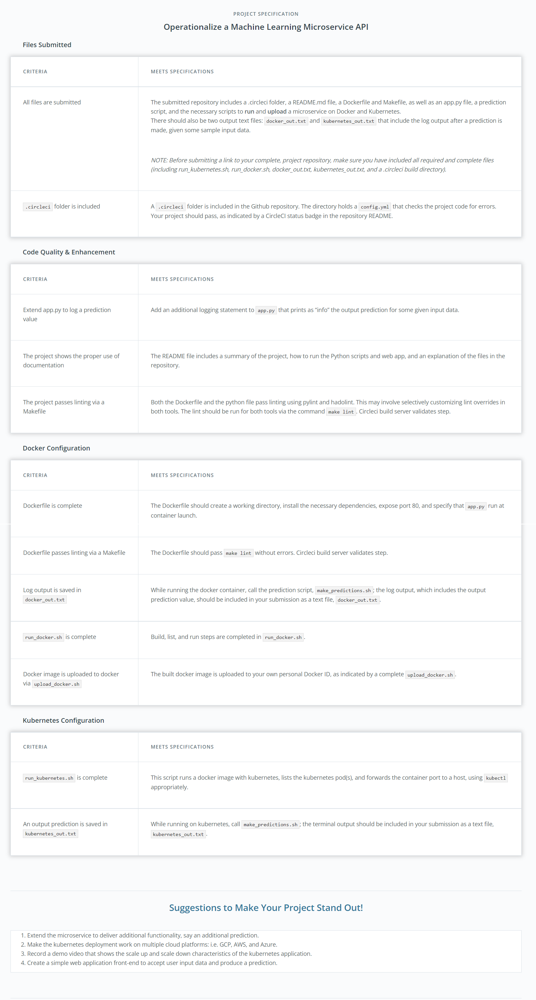
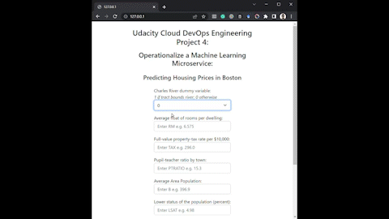

[](https://app.circleci.com/pipelines/github/pkiage/project-ml-microservice-kubernetes)

# [Udacity - Cloud DevOps Engineering - Project 4: Operationalize Machine Learning Microservice API](https://github.com/pkiage/course-DevOps_Microservices/tree/master/project-ml-microservice-kubernetes)


## A. Project Brief

In this project, you will apply the skills you have acquired in this course to operationalize a Machine Learning Microservice API. 

You are given a pre-trained, `sklearn` model that has been trained to predict housing prices in Boston according to several features, such as average rooms in a home and data about highway access, teacher-to-pupil ratios, and so on. You can read more about the data, which was initially taken from Kaggle, on [the data source site](https://www.kaggle.com/c/boston-housing). This project tests your ability to operationalize a Python flask app—in a provided file, `app.py`—that serves out predictions (inference) about housing prices through API calls. This project could be extended to any pre-trained machine learning model, such as those for image recognition and data labeling.

### Rubric



## B. [Optional] Setup to Run from Cloud9 or VSCode Remote Explorer

Helps with environment standardization that simplifies installation and configuration. (CC7-L2-C6)

### Cloud9

CC7-L2-C6

#### 1. AWS > Cloud9 > Create New Environment

- Name: name (e.g. udacityProject4)
- Environment type: Create a new instance for environment (EC2)
- Instance type: m5.large (8GiB RAM + 2 vCPU)
- Platform: Amazon Linux 2

#### 2. Increase Environment Volume Size

AWS > EC2 > Volumes > Select Volume > Actions > Modify Volume > set to at least 20GiB

#### 3. Create SSH Key Locally (in Cloud9)

Needed only first time in new AWS Cloud9 environment

```shell
ssh-keygen -t rsa
cat path_public_key_saved_to
```

#### 4. Copy the Public SSH Key and Add it to Github

Github > Settings > SSH and GPG keys > New SSH key

- Title: udacityProject4
- Key: public ssh key

#### 5. Clone Repository via SSH (in Cloud9)

```shell
git clone git@github.com:pkiage/project-ml-microservice-kubernetes.git
```

### [VSCode Remote Explorer](https://dev.to/cindyledev/remote-development-with-visual-studio-code-on-aws-ec2-4cla)

#### 1. AWS > EC2 > Launch Instance

- Name: udacityProject4-server
- AMI: Ubuntu Server 18.04
- Instance type: t3.small or greater
- Key pair: select one (that is downloaded on PC)
- Security group: group where inbound rule as below
    - Type: SSH; Source: Anywhere IPv4
- Configure storage: 20GiB or more

#### 2. VSCode Remote Explorer

Hint: Don't open VSCode from WSL, rather navitage to the repository using file explorer then open it with VSCode.

VSCode > Open a Remote Window > Connect to Host (Remote-SSH) > Configure SSH Host... > `C:\User\xxx\.ssh\config`

```config
Host connection_name
    HostName public_ipv4_address
    User aws_ec2_user1
    IdentityFile path_to_ssh_key
```

- connection_name: udacity_project4
- path_to_ssh_key: `C:\Users\user_name\.ssh\key_name.pem`

#### 3. [if permission denied (public key) and using Windows OS] [Public Key Settings](https://docs.microsoft.com/en-us/windows-server/administration/windows-commands/icacls) 

```shell
icacls.exe path_to_ssh_key /reset
icacls.exe path_to_ssh_key /grant:r "$($env:username):(r)"
icacls.exe path_to_ssh_key /inheritance:r
```

Hint: 
- Ensure using the correct aws configure

#### 3. [if error: "The process tried to write to a nonexistent pipe" ](https://stackoverflow.com/questions/60335069/vscode-remote-connection-error-the-process-tried-to-write-to-a-nonexistent-pipe)
1. Delete ssh config folder both in `C:\Program Data\ssh` and `C:\<user>\.ssh`
2. VSCode > Open a Remote Window > Connect to Host (Remote-SSH) > Add New SSH Host.. 
3. `ssh -i "C:\path\to\key" user@host`
4. Select `C:\<user>\.ssh`
5. Click connect

#### 4. Initial Setup (in Server)

Update existing packages:

```shell
sudo apt-get update
```

Python3:

```shell
sudo apt-get upgrade python3

sudo apt-get install python3-venv
```

Make:

```shell
sudo apt install make
```

[Docker](https://www.digitalocean.com/community/tutorials/how-to-install-and-use-docker-on-ubuntu-18-04):

```shell
sudo apt install apt-transport-https ca-certificates curl software-properties-common -y

curl -fsSL https://download.docker.com/linux/ubuntu/gpg | sudo apt-key add -

sudo add-apt-repository "deb [arch=amd64] https://download.docker.com/linux/ubuntu bionic stable"

sudo apt update -y

apt-cache policy docker-ce

sudo apt install docker-ce -y

sudo systemctl status docker

```

*Add username to docker group (to avoid sudo each time running docker)*

```shell
sudo passwd ubuntu

sudo usermod -aG docker ${USER}

sudo su - ${USER}

id -nG
```

#### 5. Clone Repository

VSCode > Source Control > Clone Repository > Repository Url > Clone From Url > Select Location to Clone To

- Repository Url: https://github.com/pkiage/project-ml-microservice-kubernetes.git

## B. Running The Python Scripts & Web App

### 1. Go to repository root folder

```shell
cd project-ml-microservice-kubernetes
```

Hint ensure on the right branch (develop or master)

```shell
git checkout branch_name
```

### 1. [optional] Run App Locally (standalone using Anaconda on local machine)

Tested in Windows OS

Prerequisite:
- Have Anaconda installed with preferably with Anaconda Powershell Prompt

Open Anaconda Prompt

[Manage anaconda environments](https://docs.conda.io/projects/conda/en/latest/user-guide/tasks/manage-environments.html)

```shell
conda create -n udacityproject4 python=3.7.3

conda activate udacityproject4
```

[Install requirements](https://docs.conda.io/projects/conda/en/latest/commands/install.html)

```
conda install --yes --file requirements.txt
```

Run app

```shell
python .\app-local.py
```

Make prediction via frontend: http://127.0.0.1:80



### 2. Create and Activate Environment

Henceforth preferably in Unix OS - tested in Debian Distro (Ubuntu)

```shell
# CC7-L2-C6
mkdir /tmp/local_environments
python3 -m venv /tmp/local_environments/.devops
source /tmp/local_environments/.devops/bin/activate
```

#### Install Dependencies

```shell
make install
```

[Hadolint](https://github.com/pkiage/project-ml-microservice-kubernetes/blob/master/.circleci/config.yml):

```shell
sudo wget -O /bin/hadolint https://github.com/hadolint/hadolint/releases/download/v1.16.3/hadolint-Linux-x86_64

sudo chmod +x /bin/hadolint
```

[Minikube:](https://minikube.sigs.k8s.io/docs/start/)

```shell
# OS: Linux; Architecture: x86-64; Release type: Stable; Installer type: Binary download
curl -LO https://storage.googleapis.com/minikube/releases/latest/minikube-linux-amd64

sudo install minikube-linux-amd64 /usr/local/bin/minikube
```

[Kubectl:](https://kubernetes.io/docs/tasks/tools/install-kubectl-linux/)

```shell
# Install kubectl binary with curl on Linux
curl -LO "https://dl.k8s.io/release/$(curl -L -s https://dl.k8s.io/release/stable.txt)/bin/linux/amd64/kubectl"

# curl -LO "https://dl.k8s.io/$(curl -L -s https://dl.k8s.io/release/stable.txt)/bin/linux/amd64/kubectl.sha256"

# echo "$(cat kubectl.sha256)  kubectl" | sha256sum --check

sudo install -o root -g root -m 0755 kubectl /usr/local/bin/kubectl
```

#### Confirm Requirementes Installed

```shell
docker --version

minikube version

kubectl version --output=yaml
```

### 3. Run Lint Check

Task 1: Complete the Dockerfile 
- After you complete this file and save it, it is recommended that you go back to your terminal and run make lint again to see if hadolint catches any errors in your Dockerfile.
- You are required to pass these lint checks to pass the project.

```shell
make lint
```

### 4. Run a Container & Make a Prediction

Task 2: Run a Container & Make a Prediction
- `run_docker.sh`
  - After a brief waiting period, you should see messages indicating a successful build, along with some indications that your app is being served on port 80 (also, a warning about the development server is to be expected, here).
- `make_prediction.sh`
  - In the prediction window, you should see the value of the prediction, and in your main window, where it indicates that your application is running, you should see some log statements print out

Task 3: Improve Logging & Save Output
- Copy and paste this terminal output, which has log info, in a text file `docker_out.txt`
- The `docker_out.txt` file should include all your log statements plus a line that reads something like `POST /predict HTTP/1.1” 200 -`
- The `docker_out.txt` file will be one of two, log output files that will be part of a passing, project submission.


#### Run and Build a Docker Image

```shell
sh run_docker.sh
```

Open another terminal window (Terminal B until explicitly stated otherwise)

[optional] view home of app (as defined in `app.py`):

```shell
curl localhost:8000
```

#### Make a Prediction

Ensure in the virtual environment:

```
source /tmp/local_environments/.devops/bin/activate
```

```shell
sh make_prediction.sh
```

### 5. Upload the Docker Image

In terminal window server was running `CTRL+C`

Task 4: Upload the Docker Image
- If you’ve successfully implemented authentication and tagging, you should see a successful login statement and a repository name that you specified, printed in your terminal.
- You should also be able to see your image as a repository in your docker hub account


```shell
sudo sh upload_docker.sh
```

Hint:
- Consider running `docker login` before running `upload_docker.sh`
- Confirm uploaded by viewing `hub.docker.com/repository/dockerpath` (replace dockerpath with what specified in `upload_docker.sh`)

### 6. Configure Kubernetes to Run Locally

Task 5: Configure Kubernetes to Run Locally
- After minikube starts, a cluster should be running locally. You can check that you have one cluster running by typing kubectl config view where you should see at least one cluster with a certificate-authority and server.

```shell
minikube start
```

Hint if permission denied error run:

```shell
sudo usermod -aG docker ${USER}

sudo su -${USER}
```

If space issues may have to delete files
```shell
rm -rf frontend 
rm frontend-localhost-windows.mp4
rm frontend-localhost-windows.mp4
rm test-predictions.ipynb
```

Specify space

```shell
# recommended minimum 1900MB
'minikube start --memory=1900mb'
```

or add volume size of EC2 instance and confirm 

```shell
# recommended minimum 1900MB
df -h
```

[If still error try](https://stackoverflow.com/questions/58663599/minikube-start-fails-with-requested-disk-size-0mb-is-less-than-minimum-of-200)

```shell
minikube config view

minikube config set disk-size value_from_above_command

minikube delete

minikube start
```

[If error getting ip during provisioning: IPs output should only be one line, got 2 lines](https://github.com/kubernetes/minikube/issues/8338)

With other terminal window closed

```shell
sudo rm -rf ~/.docker/config.json
sudo chown "$USER":"$USER" /home/"$USER"/.docker -R
sudo chmod g+rwx "$HOME/.docker" -R
```

Wait for completion

#### Verify

```shell
kubectl config view
```

### 7. Deploy with Kubernetes and Save Output Logs

Task 6: Deploy with Kubernetes and Save Output Logs
- `run_kubernetes.sh`
  -  Should create a pod with a name you specify
  -  Initially, your pod may be in the process of being created, as indicated by STATUS: ContainerCreating, but you just have to wait a few minutes until the pod is ready, then you can run the script again.
  -  Waiting: You can check on your pod’s status with a call to kubectl get pod and you should see the status change to Running. Then you can run the full `./run_kuberenets.sh` script again.
- `make_prediction.sh`
  - After pod is up and running
  - Copy the text output after calling run_kubernetes.sh and paste it into a file `kubernetes_out.txt`
  - This will be the second (out of two) text files that are required for submission
  - This output might look quite different from `docker_out.txt`; this new file should include your pod’s name and status, as well as the port forwarding and handling text.

#### Deploy Application on the Kubernetes Cluster

```shell
sudo sh run_kubernetes.sh
```

Check if pod is running (waint about 2 minutes)
```shell
kubectl get pod
```

Once running run `run_kubernetes.sh` again

#### Make a Prediction

In another terminal

```
source /tmp/local_environments/.devops/bin/activate
```

```shell
sudo sh make_prediction.sh
```

### 8. [Important] Cleanup once done

Clean up resources (e.g. AWS servers)

Delete the Kubernetes Cluster

```shell
minikube delete
```

## C. Files In The Repository
```folder-structure
├──  .circleci               
│   └── config.yml                        ### CircleCI configuration file
├── frontend                              ### [Flask](https://flask.palletsprojects.com/en/2.2.x/api/#flask.Flask) instance [template](https://flask.palletsprojects.com/en/2.2.x/templating/) folder used in app-local.py
│   └── index.html                        ### Name of template rendered by [render_template()](https://flask.palletsprojects.com/en/2.2.x/api/#flask.render_template) method - used in app-local.py             
├── model_data  
|   ├── boston_housing_prediction.joblib  ### Presisted Python object to be loaded in app.py (pre-trained model)
|   └── housing.csv                       ### Data used in pre-trained model                      
├── output_txt_files 
|   ├── docker_out.txt                    ### Log statements from app.py following executing run_docker.sh
|   └── kubernetes_out.txt                ### Log statements after running a prediction via Kubernetes deployment
├── .gitignore                            ### Files and directories to ignore from git history
├── app-local.py                          ### Python flask app that serves out predictions (inference) about housing prices through API calls - for optional local testing with frontend
├── app.py                                ### Python flask app that serves out predictions (inference) about housing prices through API calls - deployed on Kubernetes cluster (doesn't include frontend)
├── Dockerfile                            ### Contains all commands a user could call on command line to assemble an image
├── make_predictions.sh                   ### Sends some input into containerized application via appropriate port
├── requirements.txt                      ### List of Python dependencies for the project
├── rubric.png                            ### Udacity Project 4 Rubric
├── run_docker.sh                         ### Enables getting Docker running, locally
├── run_kubernetes.sh                     ### Deploys application on the Kubernetes cluster (after uploaded docker image and configured Kubernetes so that a cluster is running)
├── test-predictions.ipynb                ### Jupyter notebook testing predictions made using the pre-trained model and sample data
└── upload_docker.sh                      ### Uploads built image to docker to make it accessible to a Kubernets cluster
```

### [housing.csv](https://github.com/pkiage/project-ml-microservice-kubernetes/blob/master/model_data/housing.csv) [data description](https://www.kaggle.com/c/boston-housing)

|Abbreviation|Description|
|---|---|
|crim|per capita crime rate by town|
|zn|proportion of residential land zoned for lots over 25,000 sq.ft|
|indus|proportion of non-retail business acres per town|
|**chas**|Charles River dummy variable (= 1 if tract bounds river; 0 otherwise)|
|nox|nitrogen oxides concentration (parts per 10 million)|
|**rm**|average number of rooms per dwelling|
|age|proportion of owner-occupied units built prior to 1940|
|dis|weighted mean of distances to five Boston employment centres|
|rad|index of accessibility to radial highways|
|**tax**|full-value property-tax rate per \$10,000|
|**ptratio**|pupil-teacher ratio by town|
|**[black](https://github.com/scikit-learn/scikit-learn/issues/16155)**|1000(Bk - 0.63)^2 where Bk is the proportion of black people by town|
|**lstat**|lower status of the population (percent)|
|medv|median value of owner-occupied homes in \$1000s|
